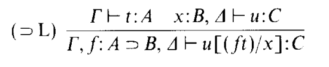

## Automating Type-Driven Development with (Co)algebras

This repository serves as a testbed for automating type-driven development in Scala 3 and explores a (co)algebraic approach to implementing various sequent calculi for intuitionistic propositional logic. Currently, it includes an implementation of the LJ sequent calculus and a simple search strategy based on iterative deepening. LJT will be added soon.

## Design

The implementation is based on encoding a sequent-based calculus as both a coalgebra and an algebra over the same characteristic functor. For instance, the LJ calculus has the following characteristic functor:

```
enum CalculusF[F: Form, T]: 
    case LeftFalse[F: Form, T](v: Int) extends CalculusF[F, T]
    case Axiom[F: Form, T](v: (Int, F)) extends CalculusF[F, T]
    case RightImplication[F: Form, T](v: (Int, F), deriv: T) extends  CalculusF[F, T]
    case LeftImplication[F: Form, T](v1: (Int, F), deriv1: T, v2: (Int, F), deriv2: T) extends  CalculusF[F, T]
    ...
```

Each rule of the system corresponds to a variant of the sum type. The coalgebra defines how to unfold different types of sequents, while the algebra determines how to extract proof terms for a given sequent. For instance, consider the [left implication rule](https://www.sciencedirect.com/science/article/pii/030439759390181R) in the LJ calculus:



There are two key aspects to this rule: how to structure the search process (bottom-up) and how to combine the proof terms (top-down). The coalgebra addresses the first aspect:

```
def coalg[F: Form]: Sequent[F] => CalculusF[F, Sequent[F]] =
    ...
    case seq@LeftImplSeq(ant1, (f, (a, b)), ant2, con) => 
        val x = seq.nextVar
        LeftImplication(
            (f, a implies b), 
            GenSeq(api.Sequent(ant1 ++ ant2 :+ (f, a implies b), a)), 
            (x, b), 
            GenSeq(api.Sequent(ant1 ++ (ant2) :+ (x, b), con)))
```

Beyond specifying how to decompose the sequent, the functor also retains information about the relevant variables, which will be used in the algebra:

```
def alg[F: Form, T: Term.Aux[F]]: CalculusF[F, Option[T]] => Option[T] = 
    ...
    case LeftImplication((f, _), d1, (x, _), d2) => 
        for 
            t <- d1
            u <- d2
        yield u.subst(x, f.`var`(t))
``` 

With this (co)algebraic formalization of the calculus, the search space is defined in terms of the final coalgebra of a derived functor, which accounts for the non-deterministic nature of the search process:

```
type SearchSpace[F] = Mu[[t] =>> List[CalculusF[F, t]]]
```

A coalgebra and an algebra for the functor `[t] =>> List[CalculusF[F, t]]` can be derived from the calculus functor, enabling the formulation of a brute-force algorithm for finite search spaces as a hylomorphism:

```
def proof[F: Form, T: Term.Aux[F]](p: F): List[T] = 
    Mu.hylo[[t] =>> List[CalculusF[F, t]]](coalg, alg)(api.Sequent.proof(p)) 
```

For more practical applications, we model a proof in the calculus as the final coalgebra of its functor:
```
type Proof[F] = Mu[[t] =>> CalculusF[F, t]]
```
We then traverse the search space to extract the proof. If a proof is found, we fold over it to obtain the corresponding proof term:

```
extension [F: Form: Show, T: Term.Aux[F]](form: F)
    def proof: Option[T] = 
        Mu.unfold(SearchSpace.coalg)(api.Sequent.proof(form))
            .findDerivationWithID(ss) // iterative deepening search
            .flatMap(Mu.fold(CalculusF.alg))
```

Note that the declarations above are parameterized by the type classes `Form` and `Term`, which encode types and programs using the tagless-final approach. This enables a generic implementation of the search process that can be instantiated both for generating Scala 3 code and for an interpretation based on custom ADTs. Sample tests are written once and applied uniformly through the tagless-final APIs instantiations.

Last, the implementation is structured into the following packages:

* `tdd.api`: Tagless-final implementation of terms, formulas, sequents, etc.
* `tdd.api.lj`: Implementation of the LJ sequent calculus.
* `tdd.initial`: Custom ADTs for implementing terms and formulas.
* `tdd.scala3`: Scala 3 macro-based implementation of the `Term` and `Formula` APIs.
* `tdd.util`: Implementation of the `Algebra`, `Coalgebra`, and `Mu` types.

## Communication

Juan Manuel Serrano - juanmanuel.serrano@urjc.es


<a rel="license" href="http://creativecommons.org/licenses/by-sa/4.0/"></a><br />This work is licensed under a <a rel="license" href="http://creativecommons.org/licenses/by-sa/4.0/">Creative Commons Attribution-ShareAlike 4.0 International License</a>.
